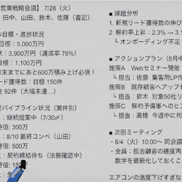

# ホワイトボードを消すゲーム / Whiteboard Eraser Game

## ▶ プレイはこちら

公開版は unityroom で遊べます。ぜひプレイしてください。

[unityroomで遊ぶ](https://unityroom.com/games/whiteboard-eraser)

> 瞬間接着剤でペンがくっついて取れなくなったホワイトボード消しを操り、制限時間内に落書きをきれいに消す3Dアクション/パズルゲーム。

## 🎮 ゲーム概要

ある日、興味本位でホワイトボード消しにペンを瞬間接着剤でくっつけた。
そこへ「今すぐホワイトボードを使いたい」という緊急連絡が入り、最悪な状況に。  
ペンで新しい線を描いてしまうリスクと向き合いながら、制限時間内にホワイトボードをきれいにしよう！

## 📼 プレイ動画

[Movie_005.mp4 を開く](Assets/_Project/Movie_005.mp4)

## ✨ 主な特徴

- **ジレンマが気持ちいい**: 動かすほどペンで線が増えるため、慎重さと大胆さの両方が求められます。
- **清掃率スコア**: 2分間の制限時間内に、ホワイトボードの白い面積をどれだけ取り戻せるかが勝負です。
- **物理演出の緊張感**: 枠への衝突音や加速時の移動音で、操作の重みと危うさを演出します。
- **落下で即ゲームオーバー**: 端へ勢いよくぶつけすぎると落下し、失敗につながるスリルがあります。
- **段階的な難易度**: ペンの数が増えるほど、インク管理とコントロール精度が問われます。

## 🕹 Controls

| 操作 | 内容 |
| --- | --- |
| 左クリック / タップ | ホワイトボード消しをつかむ・操作する |
| ドラッグ | つかんだまま移動してホワイトボードを消す |
| ボタン選択 | 画面上のUIボタンをクリックして開始・再挑戦・戻る |

## 📊 難易度一覧

| モード | 内容 |
| --- | --- |
| Normal | 基本モード。まずは操作感とルールをつかむのに最適です。 |
| Hard | くっついているペンの数が増え、より繊細な操作が必要になります。 |
| Impossible | さらにペンが増加。インク消費に気づかないとクリアできない高難易度モードです。 |

## 🧩 開発環境・動作要件

| 項目 | 内容 |
| --- | --- |
| ゲームエンジン | Unity 6.3 (6000.3.9f1) |
| 言語 | C# |
| 3D制作 | Blender |
| 主要パッケージ | Input System / URP / Cinemachine / TextMesh Pro |
| 想定プラットフォーム | PC向けUnityプロジェクト |
